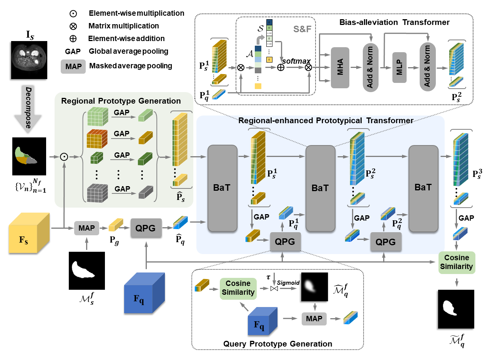

# RPT
Code for the paper id:1190




#### Abstract
Automated segmentation of large volumes of medical images is often plagued by the limited availability of fully annotated data and the diversity of organ surface properties resulting from the use of different acquisition protocols for different patients. In this paper, we introduce a more promising few-shot learning-based method named Region-enhanced Prototypical Transformer (RPT) to mitigate the effects of large intra-class diversity/bias. First, a subdivision strategy is introduced to produce a collection of regional prototypes from the foreground of the support prototype. Second, a self-selection mechanism is proposed to incorporate into the Bias-alleviated Transformer (BaT) block to suppress or remove interferences present in the query prototype and regional support prototypes. By stacking BaT blocks, the proposed RPT can iteratively optimize the generated regional prototypes and finally produce rectified and more accurate global prototypes for Few-Shot Medical Image Segmentation (FSMS). Extensive experiments are conducted on three publicly available medical image datasets, and the obtained results show consistent improvements compared to state-of-the-art FSMS methods.   


# Getting started

### Dependencies
Please install following essential dependencies:
```
dcm2nii
json5==0.8.5
jupyter==1.0.0
nibabel==2.5.1
numpy==1.22.0
opencv-python==4.5.5.62
Pillow>=8.1.1
sacred==0.8.2
scikit-image==0.18.3
SimpleITK==1.2.3
torch==1.10.2
torchvision=0.11.2
tqdm==4.62.3
```

### Data sets and pre-processing
Download:
1) [Combined Healthy Abdominal Organ Segmentation data set](https://chaos.grand-challenge.org/)
2) [Multi-sequence Cardiac MRI Segmentation data set](https://zmiclab.github.io/projects/mscmrseg19/) (bSSFP fold)
3) [Multi-Atlas Abdomen Labeling Challenge](https://www.synapse.org/#!Synapse:syn3193805/wiki/218292)

Pre-processing is performed according to [Ouyang et al.](https://github.com/cheng-01037/Self-supervised-Fewshot-Medical-Image-Segmentation/tree/2f2a22b74890cb9ad5e56ac234ea02b9f1c7a535) and we follow the procedure on their github repository.

### Training
1. Compile `./supervoxels/felzenszwalb_3d_cy.pyx` with cython (`python ./supervoxels/setup.py build_ext --inplace`) and run `./supervoxels/generate_supervoxels.py` 
2. Download pre-trained ResNet-101 weights [vanilla version](https://download.pytorch.org/models/resnet101-63fe2227.pth) or [deeplabv3 version](https://download.pytorch.org/models/deeplabv3_resnet101_coco-586e9e4e.pth) and put your checkpoints folder, then replace the absolute path in the code `./models/encoder.py`.  
3. Run `./script/train.sh` 

### Inference
Run `./script/test.sh` 

